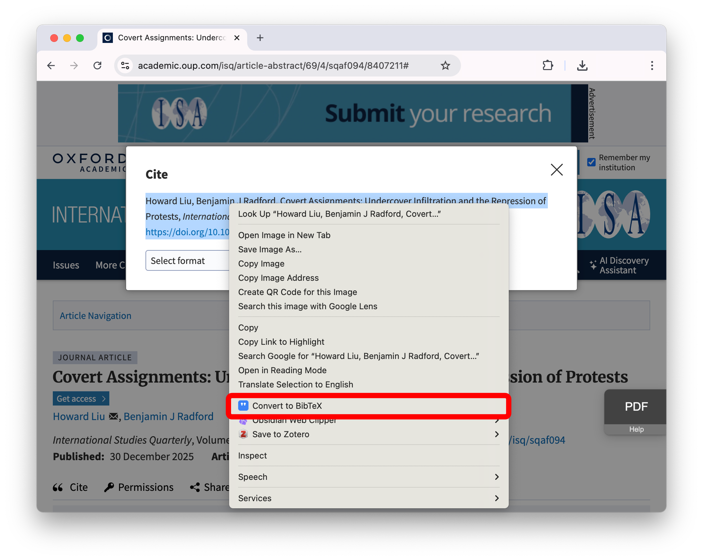

HighCite
==================
*HighCite is a Chrome browser extension for creating paste-able **BibTeX** entries.*

Benjamin J. Radford feat. Claude Sonnet 4.6

## Usage

1. Highlight the academic citation or DOI on the website. Works best for APA / MLA / Chicago / Vancouver / IEEE formats.
   - Note that DOIs consistently work the best. It will work if you highlight just the DOI:... string. 
3. Right click the highlighted citation/DOI and select **Convert to BibTex**.
4. Paste directly into your .bib file. 

## Installation

1. Clone this repository to your local computer.
2. In Chrome's address bar, navigate to: `chrome://extensions`
3. In the upper right corner, turn on **Developer mode**.
4. Click **Load unpacked**.
5. Navigate to this repository on your computer.
6. Click **Select**. 

## How It Works

1. HighCite first looks for a DOI. If it finds one, it queries the Crossref API for a full bibliographic entry.
2. Failing that, HighCite uses the Gemini Nano language model built in to Chrome to parse the highlighted citation and produce a bibtex record.
3. If Gemini Nano fails to load, HighCite will use regular expressions to parse several common bibliographic formats.
